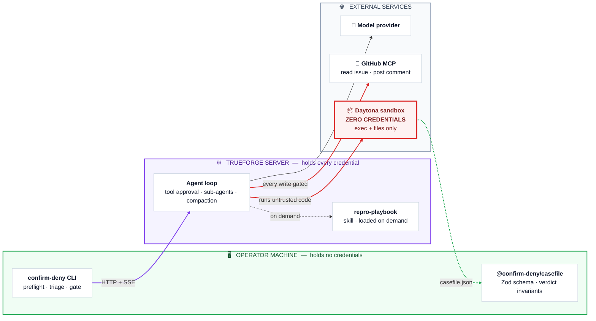
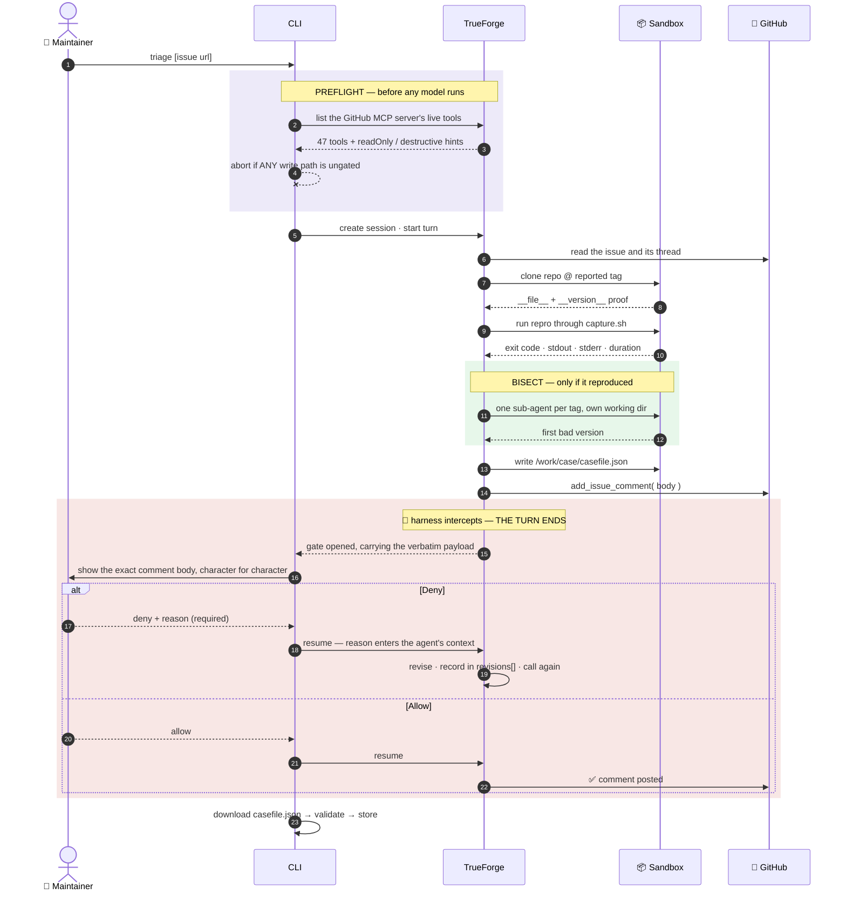

<div align="center">

# CONFIRM / DENY

### An agent that verifies bug reports instead of believing them.

It turns an unverified issue into a **schema-validated case file** — or a defensible
*"cannot reproduce"* with proof of what it tried.

**It never runs a stranger's code on the maintainer's machine.**
**It never speaks in the maintainer's name until they say so.**

<br/>

[](https://github.com/ansu555/confirm-deny/actions/workflows/ci.yml)
[](#tests)
[](https://www.typescriptlang.org/)
[](https://nodejs.org/)
[](https://github.com/truefoundry/trueforge)
[](#license)

<br/>

[Demo](#the-run-that-proves-it) · [Architecture](#architecture) · [User flow](#user-flow) ·
[Setup](#setup) · [Case file](#the-case-file) · [Why the harness](#why-the-harness-is-load-bearing)

</div>

---

## The problem

A maintainer opens a bug report and has to answer one expensive, boring question before
anything else can happen: **is this real?** Which version. Does it still happen. Was it ever
true. Is it even a bug.

An LLM is good at this — except for the two things it will do if you let it:

<table>
<tr>
<td width="50%" valign="top">

#### It runs a stranger's code

A "minimal repro" pasted by an unknown reporter is arbitrary code execution with a friendly
name. Nobody should paste it into a maintainer's shell — including an agent acting on their
behalf.

</td>
<td width="50%" valign="top">

#### It invents evidence

*"Reproduced on Python 3.12"* — from a model that never ran anything. Posted under the
project's name, closing a real report on evidence that does not exist.

</td>
</tr>
</table>

CONFIRM/DENY is built by inverting both. The agent does the work, in a disposable cloud
sandbox, and its output is not a chat reply — it is a **case file** that separates what the
sandbox *emitted* from what the model *concluded*, lists everything it could not check, and
**fails validation if the verdict is not supported by the evidence**.

> You do not prompt an agent into honesty. You make dishonesty fail the schema.

---

## The run that proves it

A real triage of [`ansu555/colwrap#1`](https://github.com/ansu555/colwrap/issues/1). The agent
was told the symptom. It found the operator:

> This is caused by an off-by-one error in the `_fits` helper function, which uses a strict
> inequality (`<`) instead of a non-strict one (`<=`) when checking if a word fits on the
> current line.

[**The full reply, live on the issue**](https://github.com/ansu555/colwrap/issues/1#issuecomment-5468809989)
— approved by a human at the gate.

The case file behind it, pulled out of the sandbox and validated:

```
verdict    ✓ REPRODUCED
confidence   low  (derived, never self-reported)
exitCode     1
firstBad     v2.3.0
bisect       v2.0.0 ✓   v2.1.0 ✓   v2.2.0 ✓   v2.3.0 ✗   v2.4.0 ✗
```

<details>
<summary><b>Why <code>confidence: low</code> on a run that got everything right</b></summary>

<br/>

Because the agent listed five things it could not verify: the reporter's Python 3.11 (the
sandbox had 3.13.15), their exact width-72 input (never shared), and the fix's behaviour
against `indent`, `break_long_words`, and `wrap_paragraphs`.

Confidence is **derived on our side** from evidence, unverified-claim count, and bisect
depth — the model never writes the field and has no way to inflate it. So honesty costs the
agent its own score. That is the design working, not a weak result.

</details>

---

## Architecture

Three trust zones. The credential boundary is **architectural, not a policy we wrote**.



| Zone | Holds | Runs untrusted code |
|:--|:--|:--|
| **Operator machine** | nothing but a TrueForge token | no |
| **TrueForge server** | model key, GitHub PAT, Daytona key | no |
| **Daytona sandbox** | **nothing** | **yes — this is the only place** |

There is no supported channel for handing a credential to the sandbox. That is also why this
works on **public repositories only** — not a limitation to apologise for, but the reason the
safety claim holds.

---

## User flow



The gated call **ends the turn**; it does not block a thread. Resuming is a *new* turn carrying
the human's decision — which is what makes the approver and the operator separable in a hosted
deployment.

---

## The case file

The deliverable. The issue comment is only its summary.

```jsonc
{
  "issue":    { "url": "…", "number": 1, "repo": "owner/name" },
  "verdict":  "REPRODUCED",

  "evidence": {                          // ← what the SANDBOX emitted
    "environment":  { "os": "…", "runtime": "…", "packageVersions": { "…": "…" } },
    "reproScript":  { "path": "/work/case/repro.py", "contents": "…" },
    "command": "…", "exitCode": 1, "stdout": "…", "stderr": "…",
    "durationMs": 412, "truncated": false
  },

  "analysis": {                          // ← what the MODEL concluded
    "summary": "…",
    "firstBadVersion": "v2.3.0",
    "bisectTrail": [{ "version": "v2.2.0", "failed": false }],
    "unverifiedClaims": ["…"],           // ← the field that earns trust
    "openQuestion": null,
    "duplicateOf": [], "documentedBehaviourRef": null
  },

  "draftReply": "…", "labels": [], "revisions": []
}
```

`confidence` is **absent by design** — the model cannot write it. It is derived after
validation from evidence, unverified-claim count, and bisect depth.

### Verdicts are invariants, not labels

Each verdict carries a rule the schema **enforces**. A case file whose verdict its own evidence
cannot support is rejected, and the run fails loudly rather than publishing.

| | Verdict | The schema requires |
|:--|:--|:--|
| `✓` | **REPRODUCED** | evidence present, and a **non-zero** exit code |
| `○` | **CANNOT_REPRODUCE** | evidence present, and a **zero** exit code |
| `?` | **NEEDS_INFO** | **no** evidence, and exactly one specific answerable question |
| `⧉` | **DUPLICATE** | at least one linked issue, each with a stated reason |
| `—` | **NOT_A_BUG** | a link to the doc or test that defines the behaviour |

> [!NOTE]
> `REPRODUCED` with `exitCode: 0` is the archetypal hallucination — a confident claim with a
> passing test behind it. It is structurally unpublishable here.

**Validation runs before the gate opens, not after.** The case file is pulled out of the
sandbox and checked while the turn is still paused — so an unsupported verdict aborts the run
with nothing posted, rather than being noticed after the comment is already on the issue. A
paused turn with no readable case file is refused outright: a human asked to approve a reply
with no checkable evidence behind it is the rubber stamp this design exists to avoid.

---

## The informed gate

Approval prompts are common. Most are rubber stamps, because the human is asked *"post this —
OK?"* with the evidence forty messages up the scroll.

This gate arrives carrying the traceback, the exit code, the runnable repro, and an explicit
list of **what the agent could not verify** — the field that actually causes a human to press
Deny.

```console
⏸  APPROVAL REQUIRED
   add_issue_comment on github
   {
     "owner": "ansu555",
     "repo": "colwrap",
     "issue_number": 1,
     "body": "I reproduced this on v2.3.0. …"
   }

   [a]llow / [d]eny: d
   reason (required): _
```

Two decisions make it a gate rather than a checkbox:

- **The exact payload is shown verbatim** — never a paraphrase. If a human approves a summary,
  they did not approve the action.
- **Deny requires a reason.** The harness makes `reason` optional; we do not. The reason goes
  back into the agent's context, it revises, records the denial and the previous draft in
  `revisions[]`, and asks again.

---

## Setup

<div align="center">

**Prerequisites** — Node ≥ 22.14 · pnpm · a [Daytona](https://daytona.io) key ·
a model-provider key · a GitHub PAT with `repo`

</div>

### 1 · Install

```bash
git clone https://github.com/ansu555/confirm-deny.git
cd confirm-deny
pnpm install
```

### 2 · Run the harness

```bash
npx @truefoundry/trueforge@latest      # → http://localhost:8790
```

This is **local mode**: one process, SQLite, no Docker, auth disabled. The boot log says
`Auth is disabled; browser login is off` — which is why `TRUEFORGE_TOKEN` is left **empty**.

> [!WARNING]
> Local mode is for your machine only. For anything shared, use hosted mode — Postgres +
> Redis, via Docker Compose or the `charts/trueforge` Helm chart.

### 3 · Configure the providers

Everything the quickstart tells you to click is a REST call under `/api/v1/settings/*`.
Schemas live at `/api/v1/openapi.json`.

| # | Provider | Notes |
|:--|:--|:--|
| **a** | **Model** | FQN is `<provider>/<model>`, **dots become dashes** — `gemini-3.1-flash-lite` registers as `gemini-3-1-flash-lite`. Declare the model's **real** `context_length`; a value too small silently cancels long turns. |
| **b** | **Sandbox** — Daytona | API URL `https://app.daytona.io/api`. Set a **default region** in the Daytona dashboard or provisioning 500s. Set `auto_delete` so stale boxes don't hit the 30 GiB disk cap. |
| **c** | **Connector** — GitHub | Name it `github` (or set `GITHUB_MCP_SERVER`). PAT needs `repo`. |
| **d** | **Skill** — `repro-playbook` | Add from this repo at `skills/repro-playbook`. **Pin to a commit SHA before demoing** so a mid-demo push cannot change agent behaviour. |

### 4 · Configure this app

```bash
cp .env.example .env
```

```ini
TRUEFORGE_BASE_URL=http://localhost:8790
TRUEFORGE_TOKEN=                          # empty in local mode — auth is off
CONFIRM_DENY_MODEL=openrouter/glm-5-3-flash
GITHUB_MCP_SERVER=github
CONFIRM_DENY_ITERATION_LIMIT=200
```

> [!TIP]
> On some networks Node resolves the gateway over IPv6 and hangs.
> Prefix with `NODE_OPTIONS=--dns-result-order=ipv4first`.

### 5 · Audit the gate — **always, first**

```bash
node packages/runner/src/cli.ts preflight
```

```console
✓ every write path on this server pauses for a human
  gated: 19 tools (18 @write + delete_file)
```

This is not a formality. `requireApprovalForTools` **replaces** the harness default rather than
extending it, and its literal tool names are **never validated** — a stale or misspelled name
gates nothing and says nothing. `preflight` resolves the policy against the **live** tool list
and exits non-zero if a single write path would run unsupervised.

### 6 · Triage

```bash
node packages/runner/src/cli.ts triage https://github.com/ansu555/colwrap/issues/1
```

### 7 · Optional — run it from the TrueForge chat UI

```bash
node packages/runner/src/register-agent.ts
```

Publishes the same `AgentSpec` as a named persistent agent, so the stock UI — which already
ships an approval bar with deny-and-reason — can drive it.

<details>
<summary><b>Verify the sandbox is real before you trust a run</b></summary>

<br/>

Standalone TrueForge logs `Local sandbox fallback is available` and will execute the repro
**on the host** if no sandbox provider is configured. The run looks entirely successful while
doing the one thing this project promises never to do.

**The runner now refuses to continue** unless the `sandbox.created` id carries a remote
provider prefix (`v1:daytona:` by default, `CONFIRM_DENY_SANDBOX_PREFIX` to override). The
check is one line, and it is the difference between a documented hazard and an enforced one.

</details>

---

## Commands

| Command | What it does |
|:--|:--|
| `cli.ts preflight` | Resolve the approval policy against the live MCP tool list. Non-zero exit if any write path is ungated. |
| `cli.ts triage <url>` | Full arc: preflight → session → sandbox → repro → bisect → case file → gate. |
| `register-agent.ts` | Publish the agent to TrueForge so the stock chat UI can run it. |
| `pnpm test` | 41 tests. |
| `pnpm typecheck` | Project-wide `tsc -b`. |

---

## Project layout

```
confirm-deny
├─ packages/
│  ├─ casefile/                  the contract — no I/O, no harness
│  │  ├─ src/schema.ts           Zod shape + verdict invariants (superRefine)
│  │  └─ src/verdict.ts          the five verdicts + derived confidence
│  └─ runner/
│     ├─ src/policy.ts           live-tool audit · UngatedWritePathError
│     ├─ src/agent-spec.ts       model, instructions, gated tools, sandbox config
│     ├─ src/runner.ts           turn streaming, gate detection, artifact pull
│     ├─ src/gate.ts             pending-call resolution · call_tool unwrapping
│     ├─ src/artifacts.ts        sandbox_artifacts parsing + validation
│     └─ src/cli.ts              the operator surface
├─ skills/repro-playbook/        the procedure the agent follows
│  ├─ SKILL.md                   8 steps, a budget, and a stopping rule
│  ├─ scripts/capture.sh         exit code · stdout · stderr · duration → JSON
│  └─ references/                verdict rules · reply templates · example case file
└─ .github/workflows/ci.yml      typecheck + tests on every PR
```

---

## Why the harness is load-bearing

Every feature is here because **removing it makes the job impossible** — not to tick a box.

| Feature | Remove it and… |
|:--|:--|
| **Sandbox** | you are executing a stranger's repro on the maintainer's laptop |
| **Tool approval** | the agent posts in the maintainer's name, unreviewed |
| **Skills** | the procedure is a wall of prompt, loaded on every call, drifting every run |
| **MCP** | there is no issue to read and no reply to post |
| **Sub-agents** | bisect is serial — five checkouts in one context window |
| **Context management** | a long thread plus sandbox output blows the window mid-run |

---

## Tests

```bash
pnpm test        # 41 passing
```

The one worth pointing at is the **gate regression test**: a fixture of a paused turn asserting
the runner emits exactly one `user.tool_approval` per pending call, with the right
`toolCallId`, and that a deny carries its reason. It goes red the day the gate stops firing —
a regression test for a safety property, not a behaviour.

The verdict invariants are executable too, enforced *inside* the schema rather than beside it.
**A verdict that cannot show its evidence fails the build.**

Deliberately not tested: load, cross-browser, and a mocked GitHub MCP server. Sandbox behaviour
is exercised through real runs — a mocked sandbox would test nothing that matters here.

---

## Three things we got wrong, found by running it

Written down because they are more useful than the parts that worked.

<details open>
<summary><b>1 · Our instructions disabled our own gate</b></summary>

<br/>

The skill said *"Draft the reply, then stop."* The agent spec said *"you never decide to post."*
The per-issue message said *"Do not post anything."*

An obedient model did exactly that: drafted, called nothing, ended the turn — and **no approval
gate ever opened**, because a gate only fires when the tool is actually *called*. Wording
written to sound safe had the effect of disabling the safety mechanism it described.

Refusing to call the tool does not protect the maintainer. It leaves them with nothing to
decide.

</details>

<details>
<summary><b>2 · We gated a tool that does not exist</b></summary>

<br/>

The approval policy listed `update_issue_labels` for three days. The first `preflight` against a
live GitHub MCP connection showed that neither it nor `label_write` exists — there is no
label-write tool of any name.

Nothing validates `requireApprovalForTools`, so an unknown literal is silently ignored: it read
as a gate in the source and was never there at runtime. That is why `preflight` audits against
the live tool list instead of trusting the names in our own code.

</details>

<details>
<summary><b>3 · The local sandbox fallback would have faked a pass</b></summary>

<br/>

Standalone TrueForge logs `Local sandbox fallback is available` and executes code **on the
host** when no sandbox provider is configured. A run would look completely successful while
doing the one thing this project promises never to do.

We wrote this down as a hazard and told the operator to check the sandbox id by eye. A code
review pointed out the obvious: the README claimed the product *never* runs reporter code on
the maintainer's machine, while the runner accepted any sandbox id it was handed. A documented
hazard is not a control. It is now asserted in `runner.ts` and the run aborts on a
non-remote sandbox.

</details>

---

## Qodo Code Review Evidence

Every substantive change after the first live run went through a pull request. **All seven are
merged, each green on CI** — typecheck plus the 41 tests.

| PR | Title | Review outcome |
|:--|:--|:--|
| [#1](https://github.com/ansu555/confirm-deny/pull/1) | Make the agent call the write tool so the approval gate can fire | — |
| [#2](https://github.com/ansu555/confirm-deny/pull/2) | Add CI, and correct the README to match what the project does | — |
| [#3](https://github.com/ansu555/confirm-deny/pull/3) | Link both PRs and be straight about the review trail | — |
| [#4](https://github.com/ansu555/confirm-deny/pull/4) | Raise the iteration limit and surface cancelled turns | — |
| [#5](https://github.com/ansu555/confirm-deny/pull/5) | Name both causes of a cancelled turn | — |
| [#6](https://github.com/ansu555/confirm-deny/pull/6) | Give the agent a budget and a stopping rule | **1 Correctness finding — fixed, re-reviewed clean** |
| [#7](https://github.com/ansu555/confirm-deny/pull/7) | Fix the case-file skeleton to match the schema | **3 findings, in a chain — fixed, re-reviewed clean** |

### What the review actually caught

**PR #6 — [Correctness] Misclassifies failed setup as absent bug.** The first draft of the
stopping rule told the agent to return `CANNOT_REPRODUCE` for any non-reproduction on the
reported version — *without requiring the run to have succeeded*. A bad checkout or a missing
dependency would have closed a genuine bug report on evidence that does not exist. The rule now
names faithful execution as a precondition and routes setup failures to `NEEDS_INFO`.

**PR #7 — [High] Skeleton fabricates environment evidence.** The case-file template carried
concrete sample values — `Linux 6.8.0`, `Python 3.12.4`, `colwrap 2.4.0`. An agent copying them
reports an environment it never measured: **fabricated evidence, inside the instructions of an
anti-fabrication agent.** Then the review caught the fix introducing a schema contradiction
(`REPRODUCED` with `exitCode: 0`), and the fix to *that* quoting the integer into a string.

Three real defects, in a chain, in the exact place the project claims to be most careful. That
is a better argument for code review than any clean run.

> Stated plainly, because the project's own honesty rule applies to its own README: **the trail
> is real but thin.** The build spent its first day standing the harness up, and the pull
> requests start from the point where the agent first ran end to end. Earlier commits went
> directly to `main` via an editor auto-committer, which is visible in the history and is not
> backdated or disguised here.

---

## Honest status

- **The CLI is the product.** There is no bespoke web UI — a triage desk was designed and cut
  against its own deadline. `register-agent.ts` publishes the same agent to the stock TrueForge
  chat UI instead. A good agent in a stock UI beats a mediocre agent in a custom one.
- **Bisect runs in parallel sub-agents**, one working directory each under
  `/work/bisect/<version>/`. This was planned as the first thing to cut; it survived because
  the agent fans out on its own once `dynamicSubAgents` is enabled — a fair illustration of
  what the harness is doing for us.
- **The store is a JSON file** with an atomic write. Deliberate, not an oversight: TrueForge's
  session is the source of truth, and anything lost is recoverable by re-reading it.
- **Model availability, not model capability, was the binding constraint.** The free Gemini
  tier returned `429` after roughly one run; `openrouter/glm-5-3-flash` is what the verified
  runs used. Notably, the OpenRouter SSE stream once blamed for an
  `Unexpected end of JSON input` parses cleanly on TrueForge v0.1.4 — that was never
  TrueForge's problem.
- **Public repositories only**, permanently. The sandbox holds no credentials and there is no
  supported way to give it any.
- **Open, and unresolved at the time of writing: the skill does not always reach the agent.**
  `repro-playbook` is registered on the server and named in the agent spec, but in four
  consecutive runs the session produced **no skill-load event at all**, and the agent
  improvised a case file in a shape it invented — `reproduction.status: "confirmed"` where the
  schema wants `verdict`. Validation rejected it and nothing was posted, which is the gate
  behaving correctly, but the arc does not complete while this holds. It is recorded here
  rather than hidden because a verified run earlier in the build *did* load the skill, so this
  is a live intermittency we do not yet understand, not a known limitation.
- Development probes (`verify-gate`, `pull-test`) were deleted rather than shipped as
  half-tests.

---

## Demo target

[`ansu555/colwrap`](https://github.com/ansu555/colwrap) is a seeded target, not part of the
product — a small text-wrapping library with a bug planted at `v2.3.0` and four issues written
to produce four **different** verdicts. That is what shows the agent is judging rather than
agreeing.

| Issue | Expected | Why it is there |
|:--|:--|:--|
| [#1](https://github.com/ansu555/colwrap/issues/1) | `✓ REPRODUCED` | real bug — must be found *and* bisected to `v2.3.0` |
| [#2](https://github.com/ansu555/colwrap/issues/2) | `○ CANNOT_REPRODUCE` | reporter was on a version predating the bug |
| [#3](https://github.com/ansu555/colwrap/issues/3) | `? NEEDS_INFO` | no version, no steps, no reproducible claim |
| [#4](https://github.com/ansu555/colwrap/issues/4) | `— NOT_A_BUG` | documented behaviour, working as specified |

Any public repository works. Nothing needs to be installed on the target.

---

<div align="center">

## License

MIT

<br/>

Built on **[TrueForge](https://github.com/truefoundry/trueforge)** for The Agent Harness Hackathon.

</div>
